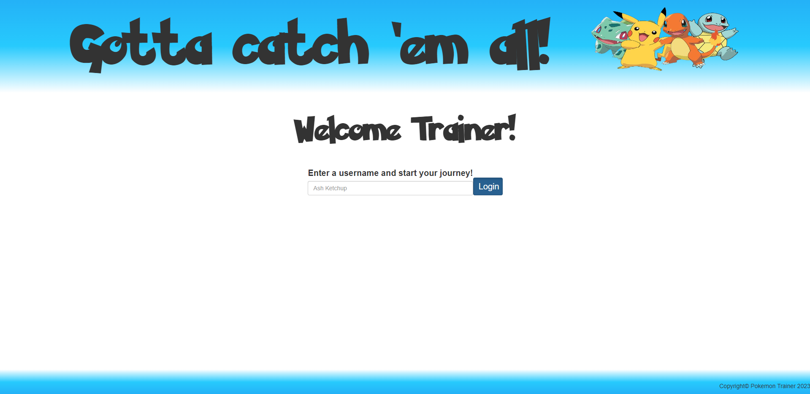
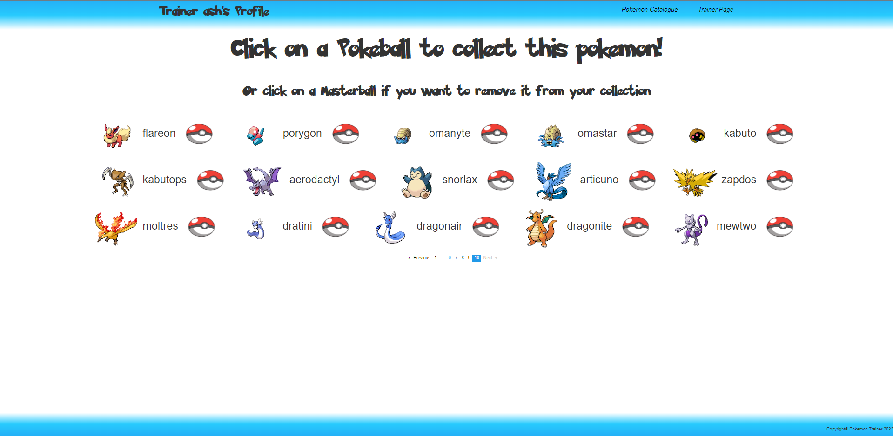
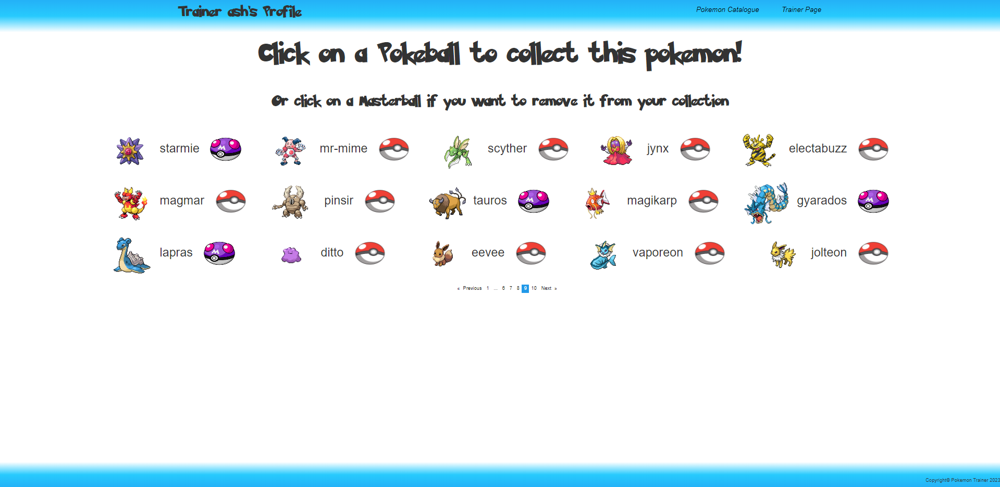
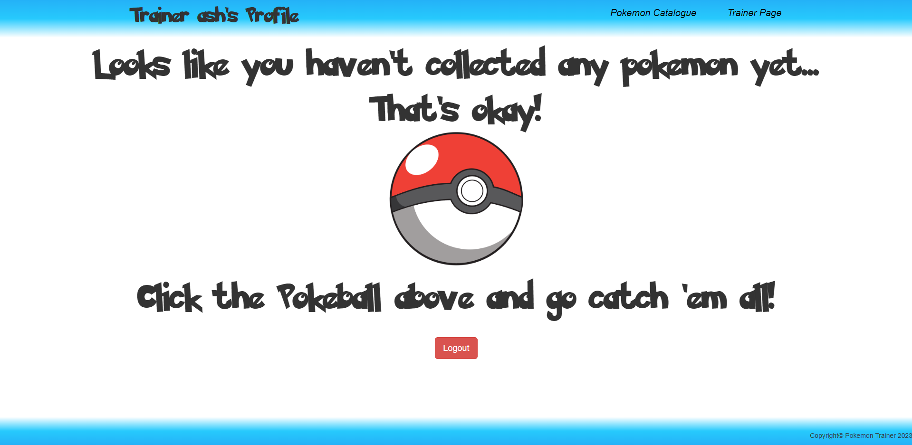

# **Pokemon Trainer**

**Contributors:**  **George Pegias – Ziogas Tilemachos**

This is the third assignment of the FrontEnd section of Noroff FullStack Course. It is an Angular project, with Bootstrap for styling.

The project result a web application, with the use of two APIs ( **PokeAPI** used for GET requests only and **Trainer API** making POST and READ for trainer logins, PATCH and READ for modifying the Pokemon field). The web app represents a "collection", a catalogue of Pokemon that a user (or trainer), is able to click a button next to each Pokemon and add it to their personal collection and click again to remove it. They can then navigate to the next page and view their collection (more details below regarding each page can be found below).

**About the pages:**

- **Login Page:** The user comes across a login form prompting them to enter a valid username to carry on to the next page. A valid username consists of a string from 3 to 15 Latin only characters. One can't view the next pages if they don't complete the login action; hence they are not "logged in".

- **Pokemon-Catalogue Page:** This is the main page of the application. The user (from now on trainer) is greeted with a list of the 151 "classic" Pokemon. They then have the option to click on a Pokeball image (which is a button that implements the collect() function) and add the respective Pokemon to their personal collection, which can be seen in the Trainer Page. The Pokeball, after loading finishes and the action is went through, is changed into a Masterball, indicating that this Pokemon is collected by the Trainer. Alternatively, they also have the option to remove a Pokemon from their collection by clicking the Masterball image (also a button).

- **Trainer** _ **Page:** _ Here the Trainer can view and interact with their personal collection of Pokemon, and can also choose to remove them from the collection. If they have not yet selected any Pokemon, they come across a big image of a Pokeball, that is a navlink to the Pokemon-Catalogue Page, and urges them to collect some Pokemon. Lastly, Trainer has the option to logout from the web application by clicking the Logout button at the end of the bottom of the page. Their collection persists through the logout, and will be present the next time they log back in.

Next, we are taking a look into the **services** and **components** directories placed in the **app** subdirectory of the **src** directory.

They project makes use of the following services that implement the following functions:

1. **trainer service:** The functions needed to interact with the instances of the Trainer model
2. **login service:** All http request-functions for the **Trainer API**
3. **pokemon-catalogue service:** Function to "fetch" the Pokemon from the **PokeAPI** and store them into an array, as well as a function to "find" a Pokemon by its name field from the Pokemon array.
4. **collection service:** Functions that alter by adding and removing Pokemon objects from the "collection" (Pokemon array) as well as the pokemon field of the **Trainer API**.

Regarding the components used on this project, they are divided into two categories:

- Ones that are have no functionality and present for styling. These ones the **login-header, the navbar-top and the navbar-bottom** (the navbar top actually hosts two navlinks for the Pokemon-Catalogue and Trainer Page but besides that, nothing else worth mentioning).
- Ones that implement the service functions and pass them down to their HTML elements. These are the **login-form** , the collect-button, the **logout-button** , the **pokemon-list** and the **pokemon-list-item** components.

_Taking a look into the functional components:_

1. **login-form** : Validates the user input for username and submits it to the API with the use of the login button.
2. **collect-button** : Adds a Pokemon object from the trainer's collection and the Pokemon field of Trainer API if it's displayed as a Pokeball or removes it if it's displayed as a Masterball.
3. **logout-button:** Deletes the trainer's key from the session storage and refreshes the page so that the user, with the help of **withAuth.guard** , is redirected to the login-page.
4. **pokemon-list:** Displays the pokemonList array as an unordered list with three columns. With the use of NgxPagination module, the 150 elements (Pokemon objects) of the list are divided between 10 pages of 15 Pokemon each.
5. **Pokemon-list-item** : Signle entry of the pokemon-list with the following structure from left to right: Pokemon's image, name and **collect** button.

Lastly, the rest contents of the **app** directory are covered briefly:

- The **storage-keys.enum** contains the storage-key for Trainer.
- The **withAuth.guard** , redirects the user to login page if a Trainer is not registered in the session storage.
- **Pokemon** and **Trainer** interfaces, that create instances of Trainer and Pokemon from the data received from the respective APIs.
- The **storage.utils** containes the functions **storageSave, storageRead and storageDelete** that interact with the session storage.